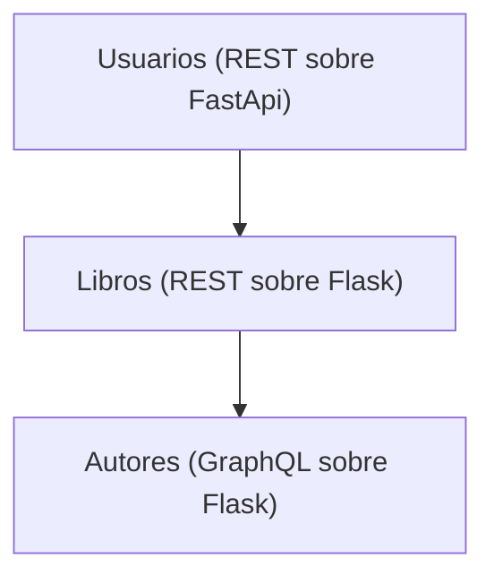

# Ejemplo de como presentar las tareas programadas

## Una biblioteca

- URL del servicio de Usuarios: http://localhost:9090/docs
- URL del servicio de Libros: http://localhost:5001/apidocs
- URL del servicio de Autores: http://localhost:5002/graphql
